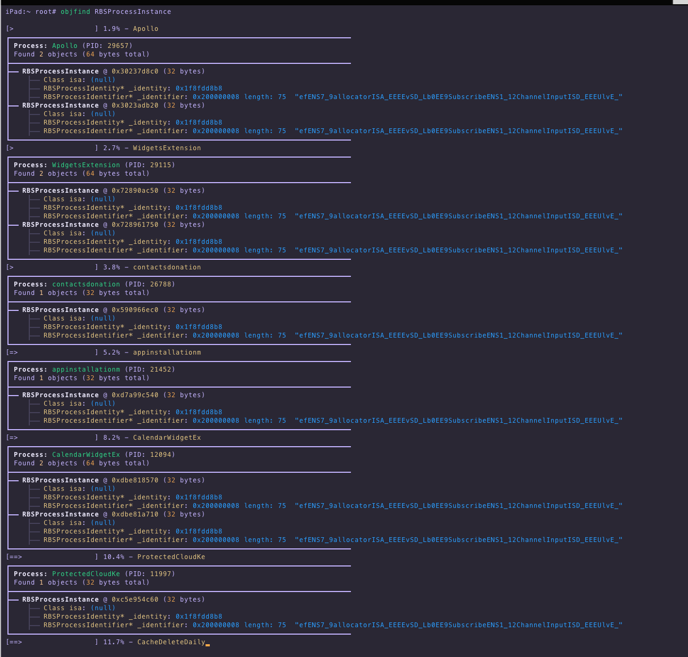

# objfind

Search running processes on iOS for instances of a given objc class.

```sh
Usage: objfind <class name>
```

```
iPad:~ root# objfind RBSProcessInstance

┌────────────────────────────────────────────────────────────────────────────────
│ Process: Apollo (PID: 29657)
│ Found 2 objects (64 bytes total)
├────────────────────────────────────────────────────────────────────────────────
├── RBSProcessInstance @ 0x30237d8c0 (32 bytes)
│    ├── Class isa: (null)
│    ├── RBSProcessIdentity* _identity: 0x1f8fdd8b8
│    ├── RBSProcessIdentifier* _identifier: 0x200000008 length: 75  "efENS7_9allocatorISA_EEEEvSD_Lb0EE9SubscribeENS1_12ChannelInputISD_EEEUlvE_"
├── RBSProcessInstance @ 0x3023adb20 (32 bytes)
│    ├── Class isa: (null)
│    ├── RBSProcessIdentity* _identity: 0x1f8fdd8b8
│    ├── RBSProcessIdentifier* _identifier: 0x200000008 length: 75  "efENS7_9allocatorISA_EEEEvSD_Lb0EE9SubscribeENS1_12ChannelInputISD_EEEUlvE_"
└────────────────────────────────────────────────────────────────────────────────
┌────────────────────────────────────────────────────────────────────────────────
│ Process: WidgetsExtension (PID: 29115)
│ Found 2 objects (64 bytes total)
├────────────────────────────────────────────────────────────────────────────────
├── RBSProcessInstance @ 0x72890ac50 (32 bytes)
│    ├── Class isa: (null)
│    ├── RBSProcessIdentity* _identity: 0x1f8fdd8b8
│    ├── RBSProcessIdentifier* _identifier: 0x200000008 length: 75  "efENS7_9allocatorISA_EEEEvSD_Lb0EE9SubscribeENS1_12ChannelInputISD_EEEUlvE_"
├── RBSProcessInstance @ 0x728961750 (32 bytes)
│    ├── Class isa: (null)
│    ├── RBSProcessIdentity* _identity: 0x1f8fdd8b8
│    ├── RBSProcessIdentifier* _identifier: 0x200000008 length: 75  "efENS7_9allocatorISA_EEEEvSD_Lb0EE9SubscribeENS1_12ChannelInputISD_EEEUlvE_"
└────────────────────────────────────────────────────────────────────────────────
[>                   ] 3.8% - contactsdonation
```


